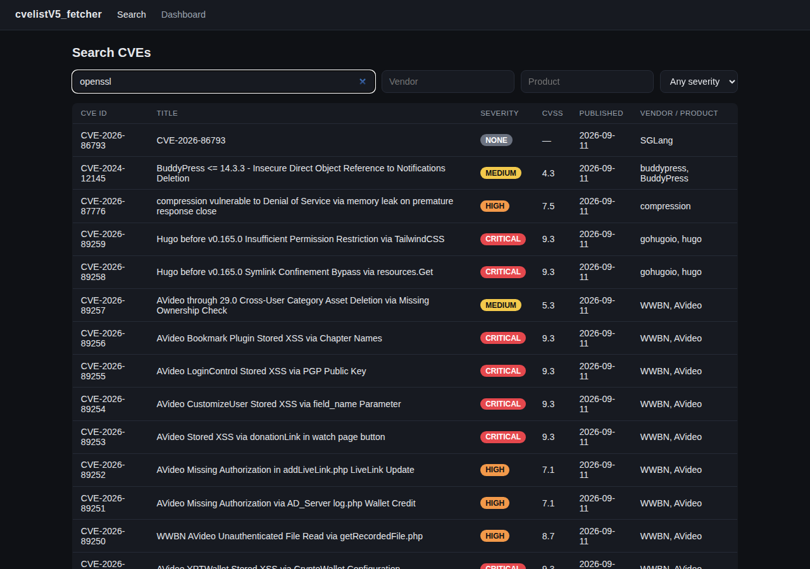
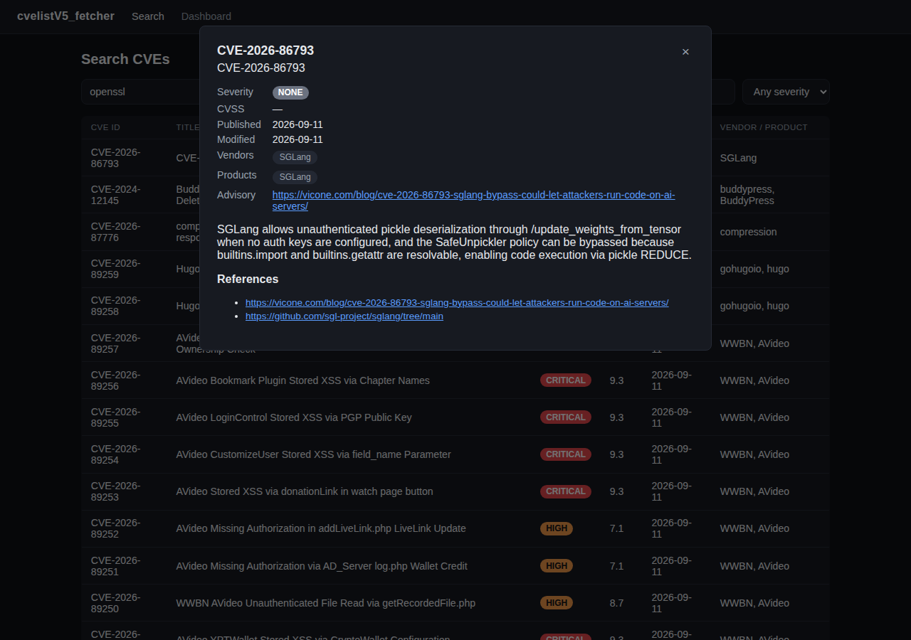
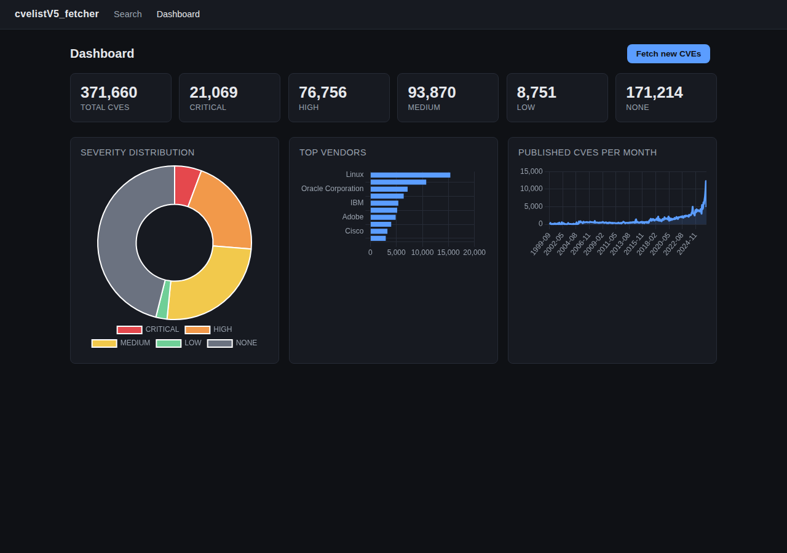

# cvelistV5_fetcher

[](https://github.com/bitfischer/cvelistV5_fetcher/actions/workflows/tests.yml)
[](LICENCE.md)
[](pyproject.toml)
[](https://fastapi.tiangolo.com/)

## What is this?

When a security flaw is found in a piece of software, it usually gets
registered in a public, shared catalog called **CVE** (Common Vulnerabilities
and Exposures) — for example `CVE-2026-12345`. This lets vendors, researchers,
and IT teams all refer to the same issue instead of describing it in their own
words. The CVE Program publishes this catalog as raw JSON data
([CVE 5.0](https://github.com/CVEProject/cvelistV5)), but that raw feed isn't
something you'd want to browse directly — it's hundreds of thousands of
individual files with no search or overview.

**cvelistV5_fetcher** takes that raw feed, imports it into a local database,
and gives you a normal web app on top: a search page and a dashboard with
charts. It's a small, self-contained **proof-of-concept** that demonstrates
the full pipeline — *download → parse → store → search* — end to end. It is
not a production vulnerability feed or monitoring tool.

## Contents

- [Screenshots](#screenshots)
- [Key features](#key-features)
- [Getting Started](#getting-started)
- [Setup](#setup)
- [Fetch CVE data](#fetch-cve-data)
- [Run the app](#run-the-app)
- [Tests](#tests)
- [Software Bill of Materials](#software-bill-of-materials)
- [Docker Compose](#docker-compose)
- [Docker (without Compose)](#docker-without-compose)
- [License](#license)

## Screenshots

**Search** — look up vulnerabilities by keyword, vendor, product, or severity:



Click a row to see the full record: severity score, affected vendors and
products, a link to the vendor's advisory, and further references:



**Dashboard** — an overview of what's in the database, plus a button to pull
in new records on demand:



## Key features

| Feature | What it does |
| --- | --- |
| 🔄 **Automatic sync** | Pulls CVE records from the official `cvelistV5` GitHub releases. First run imports everything (~370k+ records); every run after that only fetches what's new, so it's cheap to re-run on a schedule. |
| 🧹 **Cleaned-up data** | Each raw record is normalized into a simple schema: severity level, [CVSS](https://www.first.org/cvss/) score (an industry-standard 0–10 severity rating), affected vendors/products, description, and reference links. |
| 🔍 **Search UI** | Filter by keyword, vendor, product, or severity, with autocomplete and a detail view per CVE. |
| 📊 **Dashboard** | Key metrics (total, high-risk, new this week, average CVSS, vendors/products tracked), severity and CVSS-score distributions, a published-vs-modified activity trend with time-range filters, top vendors/products, and a recent-activity feed — plus a one-click "fetch new CVEs" button. |
| 🔌 **REST API** | The same data is available over a documented HTTP API (FastAPI, interactive docs at `/docs`), so the UI is just one consumer of it. |
| 📄 **About & SBOM** | An about page explaining the project, plus a full [Software Bill of Materials](#software-bill-of-materials) (CycloneDX) of every runtime dependency, with versions, licenses, and package URLs. |
| 🐳 **Docker-ready** | Ships with a `Dockerfile` and `docker-compose.yml` for a one-command start. |

## Getting Started

The quickest way to run cvelistV5_fetcher:

```sh
docker compose build
docker compose up -d
docker compose --profile fetch run --rm fetch   # sync CVE data (first run: ~500MB+, several minutes)
```

Then open http://localhost:8420/ to search, or http://localhost:8420/dashboard.html
for the dashboard. See [Docker Compose](#docker-compose) below for details.

## Setup

```sh
make install
```

Or manually:

```sh
python3 -m venv .venv --without-pip
python3 -m pip --python .venv/bin/python3 install -e ".[dev]"
```

## Fetch CVE data

```sh
make fetch
```

First run downloads the full archive (~500MB+) from the newest release with
one and imports everything. Re-running only downloads and imports delta
releases published since the last run (tracked via a watermark stored in the
database), so it's safe to schedule this yourself (cron, etc.) to keep the
data fresh.

## Run the app

```sh
make dev    # with auto-reload, for local development
make run    # production-style, binds 0.0.0.0:8420 (override with HOST/PORT)
```

Then open http://localhost:8420/ to search, or http://localhost:8420/dashboard.html
for the dashboard. API docs are at http://localhost:8420/docs.

## Tests

```sh
make test
```

## Software Bill of Materials

```sh
make sbom
```

Regenerates `web/sbom.json`, a [CycloneDX](https://cyclonedx.org/) SBOM listing
every runtime dependency (version, license, package URL). It's generated from
a clean, throwaway install of just the runtime dependencies — not the dev
venv — so test/build tooling never leaks into it. The app serves it as a
static file, and the [About page](http://localhost:8420/about.html) renders
it as a table with a download link.

## Docker Compose

```sh
docker compose up -d --build             # start the app at http://localhost:8420/
docker compose --profile fetch run --rm fetch   # sync CVE data into the shared volume
```

The `app` service serves the web UI/API. `fetch` is a one-off service (not
started by `up`) that runs `cvelistv5-fetch` against the same named volume, so
re-run it whenever you want to pull in new CVE releases. Both share the
`cvelistv5_data` volume, mounted at `/data` (`CVELISTV5_DB_PATH=/data/cves.db`),
so the database survives container recreation.

## Docker (without Compose)

```sh
docker build -t cvelistv5-fetcher .
docker run -d --name cvelistv5-fetcher -p 8420:8420 -v cvelistv5_data:/data cvelistv5-fetcher
docker exec cvelistv5-fetcher cvelistv5-fetch
```

## License

MIT License — see [LICENCE.md](LICENCE.md).
